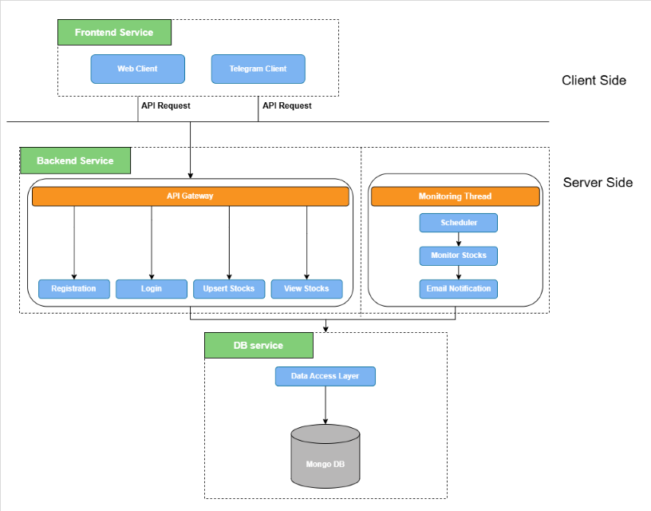
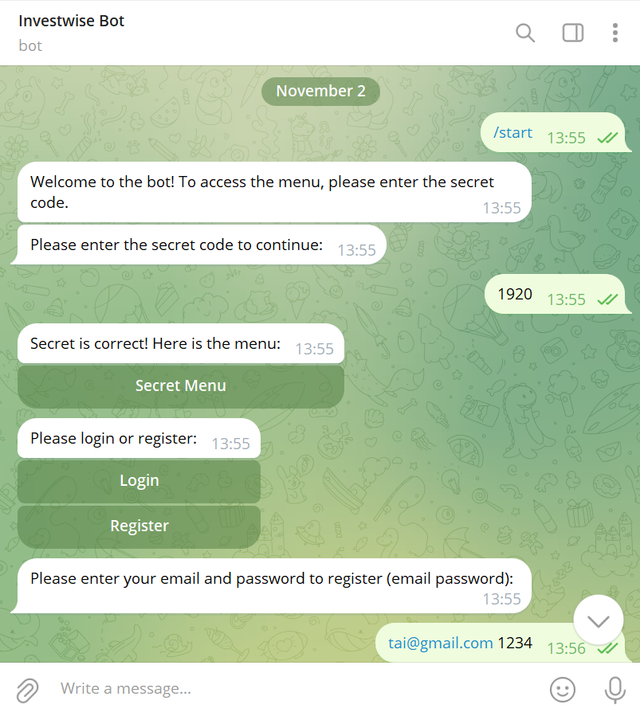
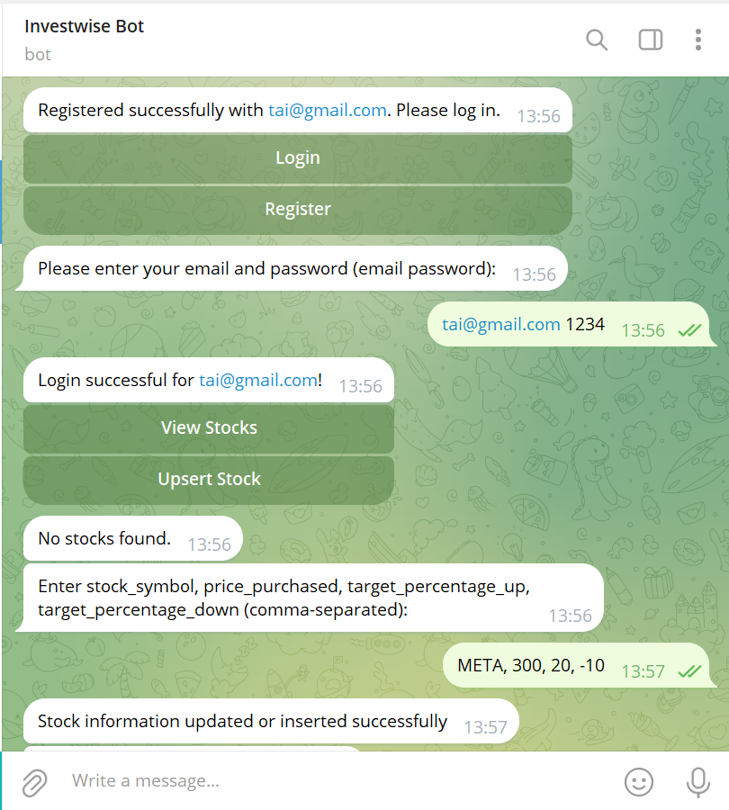
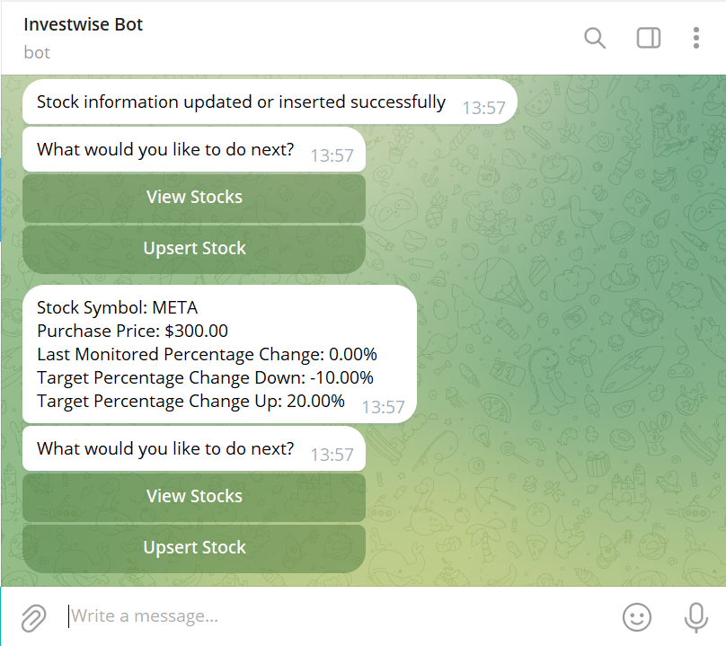

# Investwise

## Table of Contents
* [General Info](#general-info)
* [Architecture](#architecture)
* [Features](#features)
* [User Interfaces](#user-interfaces)
* [Tecnologies](#technologies)
* [Setup](#setup)
* [Project Structure](#project-structure)
 
## General Info
Investwise is a personalized stock monitoring app designed to help users stay informed about the performance of their selected stocks. The app allows users to effortlessly track stock fluctuations in real-time and set custom alerts for significant changes in stock prices. Whether you're monitoring long-term investments or responding to short-term market movements, Investwise ensures you're always up-to-date with the latest information. 

This project implements a microservices-based stock market monitoring platform. The platform is built with user personalization, offering features such as:
* Real-time Stock Monitoring: Leverages the Alpha Vantage API to provide accurate and timely stock data.
* Custom Alerts: Users can set personalized notifications to track stock price changes by a specified percentage.
* Interactive User Interface: Integrates the Telegram Bot API to deliver a dynamic and user-friendly experience in addition to the apps website. 

The application is built using a full-stack microservices architecture, with three core services:
* Frontend: Manages the user interface and interactions.
* Backend: Handles stock monitoring, user management, and notifications, powered by a dedicated monitoring thread for daily stock updates.
* Database: Provides a robust and scalable data storage solution for user accounts and stock tracking preferences.

To ensure seamless deployment and scalability, all services are containerized using Docker. This setup makes Investwise a powerful tool for both novice and experienced investors to monitor and optimize their investment strategies efficiently.

## Architecture


## Features

### 1. Login:
- Existing users can log into their account. 
- Non existing users trying to log in will be notified that their credentials are invalid.

### 2. Registration:
- New users can create an account by inputting an email and password. 

### 3. Stock Notification Subscription:
- **Insert New Stock:** Insert any stock, the price you purchased it, and your prefered percentage change.
- **Update existing Stock:** If the stock symbol already exists, we will update the database with the new preferences. 

- **Target Met Notification:**
   * When at least one of the users stocks met their desired target change, an email will be sent to the email address. 
   * After the notification is sent, the specific stock's target that was met will be automatically adjusted by 10% in the database.

- **View Stocks:**
   * The user can request to view their current stock portfolio. 
   * The last checked stock price will be shown in addition to the stock symbol, user percentage preferences, and the user's purchase price of the stock.

## User Interfaces

### 1. TelegramUI:
- The user can connect to telegram to access their Investwise account by typing '/start' and inputting the secret passcode
- This is an easy way for the user to connect to the app easily and on the go.
- ### Sample Telegram Bot Communication:
|                          |                         |
:-------------------------:|:-------------------------:
   | 
  

### 2. Graphic UI:
- The user can connect to the graphic user interface to interact with the investwise account. 

## Technologies
* fastapi==0.109.0
* pydantic==2.5.3
* uvicorn==0.27.0
* pymongo==4.6.1
* streamlit==1.32.2
* pyTelegramBotAPI
  
## Setup

### Building the Application

1. **Clone the Repository:**
   ```bash
   git clone https://github.com/Tai1212/Investwise.git
   ```

2. **Install Docker Desktop:**
   If you don't have Docker Desktop installed, you can download it from [Docker's official website](https://www.docker.com/products/docker-desktop).

3. **Navigate to the cloned directory:**
    ```bash
    cd investwise
    cd .\stock_market_app_final\
    cd .\stock_market_backend\
   ```

4. **Run this command to start the application's containers:**
   ```bash
   docker-compose -f .\docker-compose.yml up -d
   ```
Once the Docker container is up and running, access Investwise's website by visiting the following link: http://172.18.0.4:8501 or by using the Telegram App.

Feel free to explore and join Investwise!

For more details, issues, or contributions, please check out our [GitHub repository](https://github.com/Tai1212/Investwise.git).

